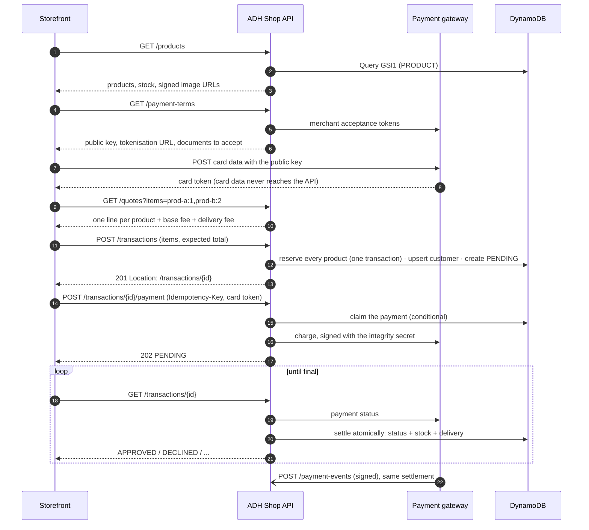

# ADH Shop API

Backend for a single-product storefront checkout: browse the catalogue, pay by card
through a payment gateway (sandbox), and receive the product. Built with NestJS and
TypeScript as a hexagonal architecture with Railway Oriented Programming, on DynamoDB,
deployed to AWS.

| Resource         | URL                                                                         |
| ---------------- | --------------------------------------------------------------------------- |
| API base         | `https://adh-api.alfredo-dominguez.dev/api/v1`                              |
| **Swagger UI**   | https://adh-api.alfredo-dominguez.dev/api/docs                              |
| OpenAPI document | https://adh-api.alfredo-dominguez.dev/api/docs-json                         |
| Liveness / ready | `/health` · `/ready`                                                        |
| Infrastructure   | [adh-shop-infra](https://github.com/alfredo0607/adh-shop-infra) (Terraform) |
| Payment webhook  | `https://adh-api.alfredo-dominguez.dev/api/v1/payment-events`               |

> [!IMPORTANT]
> **Payment events webhook — for whoever can reach the sandbox merchant account**
>
> `https://adh-api.alfredo-dominguez.dev/api/v1/payment-events`
>
> The sandbox merchant account provided with the exercise is shared, and I could not
> register this URL myself: its dashboard login currently answers `403` for me. If you
> have access, set it as the **events URL** of the sandbox environment in the
> merchant dashboard (Developers section), and the gateway will push every payment
> outcome to the API.
>
> **Nothing depends on it.** While a submitted payment is `PENDING`,
> `GET /transactions/{id}` asks the gateway for the outcome itself, so every payment
> settles by polling alone — which is how every production test so far was settled.
> The webhook only makes settlement faster and independent of the storefront. Events
> are authenticated with the events secret (SHA-256 checksum compared in constant
> time), and events older than 24 hours are refused.

---

## Contents

0. [Exercise checklist](#exercise-checklist)
1. [The checkout flow](#the-checkout-flow)
2. [Endpoints](#endpoints)
3. [Architecture](#architecture)
4. [Data model](#data-model)
5. [Consistency and concurrency](#consistency-and-concurrency)
6. [Security](#security)
7. [Tests and coverage](#tests-and-coverage)
8. [Running locally](#running-locally)
9. [Configuration](#configuration)
10. [Deployment](#deployment)
11. [Engineering documentation](#engineering-documentation)

---

## Exercise checklist

Every point the exercise asks of the backend, and where it is met. The screens themselves
(card form with brand detection, backdrop summary, responsive layout, Redux store) are
built in [adh-shop-web](https://github.com/alfredo0607/adh-shop-web); the rows below cover
the API those screens call.

### Business process

| #     | The exercise asks                                                 | Status | How                                                                                                                                                |
| ----- | ----------------------------------------------------------------- | :----: | -------------------------------------------------------------------------------------------------------------------------------------------------- |
| 1     | Show the product with its stock, description and price            |   ✅   | `GET /products` and `/products/{id}`: live stock, integer prices, images through signed, expiring CloudFront URLs                                  |
| 2–3   | Take credit card data, validated, with fake but well-formed cards |   ✅   | The card is tokenised by the gateway in the browser; the API accepts only the token and refuses anything shaped like a card number                 |
| 3     | Take delivery information                                         |   ✅   | Validated in the domain: name, email, phone, address, city, region, optional postal code; deliveries within Colombia only                          |
| 4     | Summary: product amount + base fee + delivery fee                 |   ✅   | `GET /quotes?items=` prices one or more products on the server in integer cents; fees are charged once per order; nothing is reserved yet          |
| 5.1   | Create a PENDING transaction and obtain its number                |   ✅   | `POST /transactions` → `201` with `Location`; the units of every product are reserved in one atomic write; the id doubles as the payment reference |
| 5.2   | Call the payment gateway to complete the payment                  |   ✅   | `POST /transactions/{id}/payment`: idempotent (`Idempotency-Key`), amount signed with the integrity secret                                         |
| 5.3.1 | Update the transaction with the result                            |   ✅   | Settled by polling (`GET /transactions/{id}` asks the gateway) and by the signed webhook, whichever comes first                                    |
| 5.3.2 | Assign the product to be delivered                                |   ✅   | An approval creates the delivery, with every product of the order, in the same write; `GET /transactions/{id}/delivery`                            |
| 5.3.3 | Update the product's stock                                        |   ✅   | Approved: units sold. Declined or abandoned: units returned. Every product of the order, atomic with the status change                             |
| 6     | Show the final result, then the product with its updated stock    |   ✅   | `GET /transactions/{id}` for the outcome; `GET /products` reflects the new stock immediately                                                       |

### Responsibilities

| The exercise asks                                               | Status | How                                                                                                                         |
| --------------------------------------------------------------- | :----: | --------------------------------------------------------------------------------------------------------------------------- |
| Overall API design and information architecture                 |   ✅   | Two bounded contexts, hexagonal layers, one DynamoDB table ([Architecture](#architecture), [Data model](#data-model))       |
| Decide what each endpoint receives and returns; publish Swagger |   ✅   | Explicit request and response DTOs; public [Swagger](https://adh-api.alfredo-dominguez.dev/api/docs)                        |
| Validations for real-life situations                            |   ✅   | Stale totals, two buyers for the last unit, retried payments, expired reservations, gateway outages, forged events          |
| Handle sensitive data safely                                    |   ✅   | No card data, masked personal data, secrets in SSM, signed charges and events ([Security](#security))                       |
| An API with stock, transactions, customers and deliveries       |   ✅   | All four persisted; customers deliberately reached only through their order ([Endpoints](#endpoints))                       |
| Endpoints performing different types of requests                |   ✅   | `GET` and `POST`, answering `200`, `201`, `202`, `400`, `404`, `409`, `422`, `503` where each applies                       |
| Resilient: recover the client's progress after a refresh        |   ✅   | The storefront keeps only the transaction id; `GET /transactions/{id}` returns the full state, including `paymentSubmitted` |

### Backend development

| The exercise asks                                              | Status | How                                                                                               |
| -------------------------------------------------------------- | :----: | ------------------------------------------------------------------------------------------------- |
| JavaScript/TypeScript with NestJS                              |   ✅   | NestJS 11, TypeScript in strict mode                                                              |
| Business logic outside the routing/controller layer            |   ✅   | Controllers translate HTTP only; rules live on entities, orchestration in use cases               |
| Hexagonal architecture, ports and adapters                     |   ✅   | Ports in `domain/`, adapters in `infrastructure/`; breaking the dependency rule fails the build   |
| Railway Oriented Programming in the use cases                  |   ✅   | `Result` / `ResultAsync`, including compensation on the failure track (`orElse`)                  |
| Any database, with the data model in the README                |   ✅   | DynamoDB single-table design with every access pattern ([Data model](#data-model))                |
| Any ORM or serialisation library                               |   ✅   | AWS SDK DocumentClient; explicit response DTOs, so no entity is serialised by accident            |
| Database seeded with dummy products, no create endpoint        |   ✅   | `pnpm seed`, idempotent; eighteen products in five categories, one deliberately sold out          |
| Unit tests with Jest, over 80% coverage, results in the README |   ✅   | **97.9%** statements across 479 tests ([Tests and coverage](#tests-and-coverage))                 |
| Published on a cloud provider                                  |   ✅   | AWS: EC2, ECR, DynamoDB, ElastiCache, S3, CloudFront, SSM, CloudWatch ([Deployment](#deployment)) |
| Sandbox mode only                                              |   ✅   | Sandbox keys and base URL, read from Parameter Store                                              |

### Bonus points and considerations

| The exercise asks                              | Status | How                                                                                                                                  |
| ---------------------------------------------- | :----: | ------------------------------------------------------------------------------------------------------------------------------------ |
| OWASP alignment, HTTPS and security headers    |   ✅   | Helmet and HSTS, strict CORS, input whitelist, a rate limit that cannot be bypassed at the origin                                    |
| Clean code                                     |   ✅   | Lint and type checks in CI, no `any` in production code, a full audit with its findings fixed ([docs/audits](docs/audits/README.md)) |
| Hexagonal architecture with ports and adapters |   ✅   | See above                                                                                                                            |
| Railway Oriented Programming                   |   ✅   | See above                                                                                                                            |
| Branches and pull requests per feature         |   ✅   | Every change landed through a pull request with CI                                                                                   |
| Public repository, company name absent         |   ✅   | Public; the gateway is referred to generically throughout                                                                            |

---

## The checkout flow

The storefront follows five screens: product → card and delivery details → summary →
final status → product. Each maps to the API as follows.



- **One order, several products.** The storefront's cart sends every product in one
  transaction; the "Pay with credit card" button on a product page sends one. Both follow
  the same path.
- **Approved:** the reserved units are sold and a delivery is assigned, in one DynamoDB
  transaction.
- **Declined, voided or error:** the units return to stock.
- **Abandoned:** a reservation unpaid after 15 minutes expires and its units return to
  stock (`EXPIRED`).
- **Refresh-safe:** the storefront only needs the transaction id. `GET /transactions/{id}`
  returns the full state, including `paymentSubmitted`, so a reload resumes at the right
  screen.

Sandbox cards: `4242 4242 4242 4242` is approved, `4111 1111 1111 1111` is declined. Any
future expiry date and CVC.

## Endpoints

All under `/api/v1`. Errors share one envelope:
`{ "error": { "code", "message", "details" }, "requestId" }`. Clients branch on `code`.

| Method | Path                          | Purpose                                                    | Success | Notable errors                                                                                  |
| ------ | ----------------------------- | ---------------------------------------------------------- | ------- | ----------------------------------------------------------------------------------------------- |
| GET    | `/products`                   | Paginated catalogue with category, stock and signed images | 200     | 422 `INVALID_CURSOR`                                                                            |
| GET    | `/products/{id}`              | One product                                                | 200     | 404 `PRODUCT_NOT_FOUND`                                                                         |
| GET    | `/quotes?items=`              | Price an order of 1–10 products; reserves nothing          | 200     | 404, 409 `INSUFFICIENT_STOCK` (names the product), 422 `INVALID_TRANSACTION`                    |
| POST   | `/transactions`               | Open a `PENDING` transaction and reserve every product     | 201     | 409 `INSUFFICIENT_STOCK`, 422 `AMOUNT_MISMATCH`, `INVALID_CUSTOMER`, `INVALID_DELIVERY_ADDRESS` |
| GET    | `/transactions/{id}`          | Read a transaction; settles it if the gateway has answered | 200     | 400 (not a UUID), 404                                                                           |
| GET    | `/transactions/{id}/delivery` | The delivery assigned to an approved transaction           | 200     | 404 `DELIVERY_NOT_FOUND`                                                                        |
| GET    | `/payment-terms`              | Acceptance documents, public key, tokenisation URL         | 200     | 503 `PAYMENT_GATEWAY_UNAVAILABLE`                                                               |
| POST   | `/transactions/{id}/payment`  | Charge the card; requires `Idempotency-Key`                | 202     | 400 (no key), 409 `TRANSACTION_NOT_PAYABLE` / `RESERVATION_EXPIRED`, 422 `PAYMENT_REJECTED`     |
| POST   | `/payment-events`             | Gateway webhook; signature verified (not in Swagger)       | 200     | 401 `INVALID_PAYMENT_EVENT`                                                                     |

An order is a list of products, each with its units: `items=prod-a:1,prod-b:2` on
`GET /quotes`, `"items": [{ "productId", "units" }]` on `POST /transactions`. Up to 10
products, each once, with 1 to 10 units. The base and delivery fees are charged once per
order. A shortage answers `409 INSUFFICIENT_STOCK` with the product's id in `details`, so
the storefront can say which one ran short.

HTTP semantics are deliberate: a declined card is a **successful request** whose payment
failed, so it is a status in a 200 body, never an error. `400` is for a request that
cannot be read, and `422` for one that can be read but is semantically invalid. The
complete contract, with examples, is in [Swagger](https://adh-api.alfredo-dominguez.dev/api/docs).

**Customers have no endpoint of their own, on purpose.** They are created or updated
(upserted by email) when a transaction is opened, and are visible through the
transaction and its delivery with the email and phone masked. The brief has no user
accounts, so a `GET /customers/{id}` would hand anyone holding an id a person's full
contact details. Customer data is reached only through the order it belongs to.

## Architecture

Hexagonal architecture (ports and adapters) with Railway Oriented Programming. Two
bounded contexts and a shared kernel:

```
src/
  shared/
    domain/           Result, ResultAsync, DomainError, clock and id ports — no dependencies
    infrastructure/   config, logging, health, DynamoDB client, rate limiting, idempotency
  contexts/
    catalog/          products, prices, stock, signed image URLs
    checkout/         quotes, transactions, customers, payments, settlement, deliveries
      domain/         entities, value objects, errors, PORTS
      application/    use cases — orchestration only, no I/O, no framework
      infrastructure/ adapters: HTTP controllers, DynamoDB, payment gateway, scheduler
```

- **The dependency rule is enforced by ESLint**: a domain file cannot import Nest, the
  AWS SDK, infrastructure or application code. Breaking it fails the build.
- **Ports are named for the need, not the vendor**: `PaymentGatewayPort`,
  `InventoryPort`, `ImageUrlSigner`. The checkout does not import the catalogue's
  domain; `CatalogInventoryAdapter` translates between the two.
- **Controllers only translate HTTP.** Parse, call one use case, map the result.
- **Use cases return `Result` / `ResultAsync`**, never throw for business outcomes. A
  declined payment, an out-of-stock product and a stale total are values the compiler
  forces the caller to handle. Compensation runs on the railway too: if anything fails
  after units are reserved, `orElse` releases them before the error is reported.
- **Use cases are plain classes** wired by hand in the module files, so every use case
  test is a constructor call with in-memory adapters.

Details: [`docs/guide/architecture.md`](docs/guide/architecture.md).

## Data model

One DynamoDB table (`adh-shop-store`, on-demand) and one sparse global secondary index.
A single table lets related items be read in one query and written in one transaction:
approving a payment updates the transaction, the product's stock and the delivery
atomically.

| Entity          | `PK`                       | `SK`        | `GSI1PK` / `GSI1SK`                                       | Main attributes                                                                                                                                           |
| --------------- | -------------------------- | ----------- | --------------------------------------------------------- | --------------------------------------------------------------------------------------------------------------------------------------------------------- |
| Product         | `PRODUCT#<id>`             | `#META`     | `PRODUCT` / `<id>`                                        | name, description, category, priceInCents, currency, imageKey, available, reserved, version                                                               |
| Customer        | `CUSTOMER#<sha256(email)>` | `#PROFILE`  | —                                                         | id, fullName, email, phone, createdAt                                                                                                                     |
| Transaction     | `TRANSACTION#<uuid>`       | `#META`     | `PENDING_TRANSACTION` / deadline — **only while PENDING** | status, lines (product, unit price, units), amounts, customer and address snapshot, reservationExpiresAt, paymentClaimedAt, gatewayTransactionId, version |
| Delivery        | `TRANSACTION#<uuid>`       | `#DELIVERY` | —                                                         | status, items (product, units), recipient, address, estimatedDeliveryAt                                                                                   |
| Idempotency key | `IDEMPOTENCY#<key>`        | `#REQUEST`  | —                                                         | state, fingerprint, stored response, `expiresAt` (TTL)                                                                                                    |

| Access pattern                     | How                                                                              |
| ---------------------------------- | -------------------------------------------------------------------------------- |
| List products                      | `Query GSI1 PK = PRODUCT`, cursor-paginated                                      |
| Transaction with its delivery      | `Query PK = TRANSACTION#<id>`                                                    |
| Returning customer                 | `UpdateItem` on `CUSTOMER#<hash>`: one atomic upsert                             |
| Overdue reservations, oldest first | `Query GSI1 PK = PENDING_TRANSACTION AND SK < now`: sparse, reads only open ones |
| Expired idempotency keys           | Deleted by DynamoDB TTL on `expiresAt`                                           |

Money is always integer minor units (`8999000` = $89,990.00 COP). Customer and address are
**copied** into the transaction, so an order records what was true when it was placed.
The reservation deadline is deliberately **not** called `expiresAt`: that is the TTL
attribute, and DynamoDB would delete the order.

An order's products are a list attribute on the transaction and on the delivery, read and
written with them. Items written before orders could hold several products keep the single
product in top-level attributes, and are read back as a one-line order: no migration is
needed.

## Consistency and concurrency

Every invariant is enforced by the store, not by a read-then-write in the process:

| Risk                                     | Guard                                                                                                                                   |
| ---------------------------------------- | --------------------------------------------------------------------------------------------------------------------------------------- |
| Two buyers take the last unit            | `TransactWriteItems`, one conditional update per product (`available >= :units`): every product of the order is held, or none           |
| Double tap / retry charges twice         | `Idempotency-Key` replays the stored response; **and** the transaction is claimed with a conditional write before the gateway is called |
| Webhook and polling settle at once       | Settlement conditioned on `status = PENDING AND version = previous`; the loser re-reads                                                 |
| Approval leaves stock or delivery behind | `TransactWriteItems`: transaction + the stock of every product + delivery, all or nothing                                               |
| Buyer abandons checkout                  | Expiry job every 60 s; never expires a payment still in flight at the gateway                                                           |
| Charge call times out                    | Claim kept, outcome found later by reference; nothing is charged twice                                                                  |
| Price changes between summary and pay    | Client sends the total it showed; mismatch → `422 AMOUNT_MISMATCH`. Each reservation is also conditioned on the price it read           |

These are verified against a real engine in
[`single-table.integration.spec.ts`](src/shared/infrastructure/persistence/single-table.integration.spec.ts):
ten concurrent buyers for three units produce exactly three reservations, an order with
one short product reserves none of the others, two concurrent payment claims produce
exactly one, and an inconsistent stock row rolls the whole settlement back.

## Security

- **Card data never reaches this service.** The storefront tokenises the card directly
  with the gateway; the API accepts only a token and refuses anything shaped like a card
  number.
- **The server owns the amount.** It is recomputed from stored prices and fees, taken
  from the stored transaction at charge time, and signed with the integrity secret.
- **Webhook authenticity**: SHA-256 checksum verified in constant time; events older
  than 24 h are refused.
- **Validation at the edge**: global `ValidationPipe` with `whitelist` and
  `forbidNonWhitelisted`, which blocks mass assignment. Domain rules return specific codes.
- **No data leaks**: response DTOs are built explicitly (no `reserved`, `version`, phone
  or full email); 5xx bodies are opaque, with the detail in the log under the `requestId`.
  Card, token and secret fields are redacted from logs.
- **Rate limiting**: 100 requests / minute per client IP, shared through ElastiCache
  (Valkey, IAM auth) with an atomic Lua script. The client IP is read through two trusted
  proxies, and the origin accepts HTTPS **only from Cloudflare's ranges**, so the header
  cannot be forged by skipping the edge.
- **Headers and transport**: Helmet (HSTS and others), HTTPS only, CORS limited to the
  storefront's origin, `Cache-Control: no-store` on every personal or payment response.
- **Secrets** live in SSM Parameter Store (SecureString) and reach the container only at
  deploy time. None are in the code, the image or Terraform state.
- **Images**: private S3 bucket, readable only by CloudFront, served through signed,
  expiring URLs.

Details: [`docs/guide/security.md`](docs/guide/security.md).

## Tests and coverage

```
pnpm test        # 541 tests
pnpm test:cov    # with the 80% threshold enforced
```

Latest run: **46 suites, 541 tests, all passing.**

| Scope                            | Statements |   Branches |  Functions |      Lines |
| -------------------------------- | ---------: | ---------: | ---------: | ---------: |
| **All files**                    | **97.98%** | **87.60%** | **98.23%** | **98.05%** |
| catalog · domain                 |     97.66% |     94.87% |       100% |     97.52% |
| catalog · application            |       100% |       100% |       100% |       100% |
| catalog · persistence            |     97.89% |     86.89% |       100% |     98.50% |
| checkout · domain                |     98.61% |     96.61% |       100% |     98.57% |
| checkout · application           |     97.39% |     84.62% |     96.77% |     97.93% |
| checkout · payment gateway       |     98.00% |     93.18% |       100% |     97.94% |
| checkout · persistence           |     97.39% |     84.21% |     98.39% |     97.16% |
| shared · domain (Result, errors) |     99.16% |     93.94% |       100% |     99.07% |
| shared · idempotency             |     97.70% |     76.19% |     94.44% |     98.78% |
| shared · rate limit              |     93.33% |     75.00% |     93.33% |     92.65% |

What the suite covers, beyond line counts:

- **Domain**: every entity and value object, including money arithmetic in cents, orders
  of several products, stock transitions, the payment claim, settlement and expiry rules.
- **Use cases** against in-memory adapters that behave like the real ones: compensation
  after a failed write, idempotent settlement, lost races, gateway outages.
- **HTTP contracts** through the real pipe and exception filter: status codes, `Location`,
  validation, replayed idempotent responses, and fields that must not appear.
- **Integration against real engines**: DynamoDB Local for conditions, transactions and
  the sparse index; Redis for the rate limiter's Lua script.
- **The built container** is started in CI against DynamoDB Local and probed: `/ready`,
  the OpenAPI document, and the storefront's CORS preflight.

The integration specs need DynamoDB Local and Redis running (see below). CI provides both
as service containers.

## Running locally

Requirements: Node 24, pnpm, Docker.

```bash
# 1. Dependencies and configuration
pnpm install
cp .env.example .env        # fill in the payment gateway sandbox keys

# 2. Local stores
docker run -d --name dynamodb -p 8000:8000 amazon/dynamodb-local:2.5.4
docker run -d --name redis    -p 6379:6379 redis:7-alpine

# 3. The table, with the production key schema
AWS_ACCESS_KEY_ID=local AWS_SECRET_ACCESS_KEY=local AWS_DEFAULT_REGION=us-east-1 \
aws dynamodb create-table --endpoint-url http://localhost:8000 \
  --table-name adh-shop-local --billing-mode PAY_PER_REQUEST \
  --attribute-definitions AttributeName=PK,AttributeType=S AttributeName=SK,AttributeType=S \
                          AttributeName=GSI1PK,AttributeType=S AttributeName=GSI1SK,AttributeType=S \
  --key-schema AttributeName=PK,KeyType=HASH AttributeName=SK,KeyType=RANGE \
  --global-secondary-indexes 'IndexName=GSI1,KeySchema=[{AttributeName=GSI1PK,KeyType=HASH},{AttributeName=GSI1SK,KeyType=RANGE}],Projection={ProjectionType=ALL}'

# 4. Seed the catalogue and start
pnpm seed
pnpm start:dev              # http://localhost:3000/api/docs
```

The seed is idempotent: re-running it restores the demo stock levels.

## Configuration

Validated once at boot with zod. A missing or malformed variable stops the process and
lists every problem at once. Production refuses to start without the image CDN settings.
See [`.env.example`](.env.example) for every variable with its rationale.

| Group           | Variables                                                                                                                                   |
| --------------- | ------------------------------------------------------------------------------------------------------------------------------------------- |
| Runtime         | `NODE_ENV`, `PORT`, `LOG_LEVEL`                                                                                                             |
| Data            | `AWS_REGION`, `DYNAMODB_TABLE_NAME`, `DYNAMODB_ENDPOINT` (local only)                                                                       |
| Payment gateway | `PAYMENT_API_URL`, `PAYMENT_PUBLIC_KEY`, `PAYMENT_PRIVATE_KEY`, `PAYMENT_INTEGRITY_SECRET`, `PAYMENT_EVENTS_SECRET`, `PAYMENT_TIMEOUT_MS`   |
| Pricing         | `BASE_FEE_IN_CENTS` (500.00), `DELIVERY_FEE_IN_CENTS` (1,200.00), `RESERVATION_TTL_MINUTES` (15), `RESERVATION_SWEEP_INTERVAL_SECONDS` (60) |
| Images          | `CDN_DOMAIN`, `CDN_KEY_PAIR_ID`, `CDN_PRIVATE_KEY_BASE64`, `IMAGE_URL_TTL_SECONDS`                                                          |
| Rate limiting   | `REDIS_*`, `RATE_LIMIT_*`, `TRUST_PROXY_HOPS`                                                                                               |
| HTTP            | `CORS_ALLOWED_ORIGINS`                                                                                                                      |

## Deployment

Deployed on AWS, provisioned with Terraform in
[adh-shop-infra](https://github.com/alfredo0607/adh-shop-infra):

```
Client ──HTTPS──▶ Cloudflare ──HTTPS (Cloudflare IPs only)──▶ EC2: nginx ──▶ Docker: API
                                                                   │
            DynamoDB (VPC gateway endpoint) · ElastiCache Valkey (IAM) · SSM Parameter Store
            ECR (image) · S3 + CloudFront (signed product images) · CloudWatch (logs)
```

- **CI** (every pull request): lint, typecheck, tests with coverage against Redis and
  DynamoDB Local, dependency audit, a check that no test code reaches the build, and the
  built image started and probed.
- **CD** (every merge to `main`): GitHub Actions assumes an AWS role through **OIDC** (no
  stored keys), pushes the image to ECR tagged with the commit SHA, and runs `deploy.sh` on
  the host through SSM.
- **Blue/green**: the new container starts on the idle port and must answer `/ready`, which
  reads the table, before nginx switches traffic. A release that cannot reach its data is
  never switched to, and the previous version keeps serving.
- **Graceful shutdown**: SIGTERM drains requests, closes the Redis connection and stops
  the expiry timer; `dumb-init` forwards signals; the image runs as a non-root user.

## Engineering documentation

| Document                                                   | Content                                       |
| ---------------------------------------------------------- | --------------------------------------------- |
| [`docs/guide/architecture.md`](docs/guide/architecture.md) | Layers, dependency rule, ports, ROP contract  |
| [`docs/guide/api-design.md`](docs/guide/api-design.md)     | Status codes, idempotency, pagination, errors |
| [`docs/guide/security.md`](docs/guide/security.md)         | Security standards                            |
| [`docs/guide/testing.md`](docs/guide/testing.md)           | What is tested, and how                       |
| [`docs/guide/git-workflow.md`](docs/guide/git-workflow.md) | Branches, commits, pull requests              |
| [`docs/audits/`](docs/audits/README.md)                    | Technical audits and their findings           |
