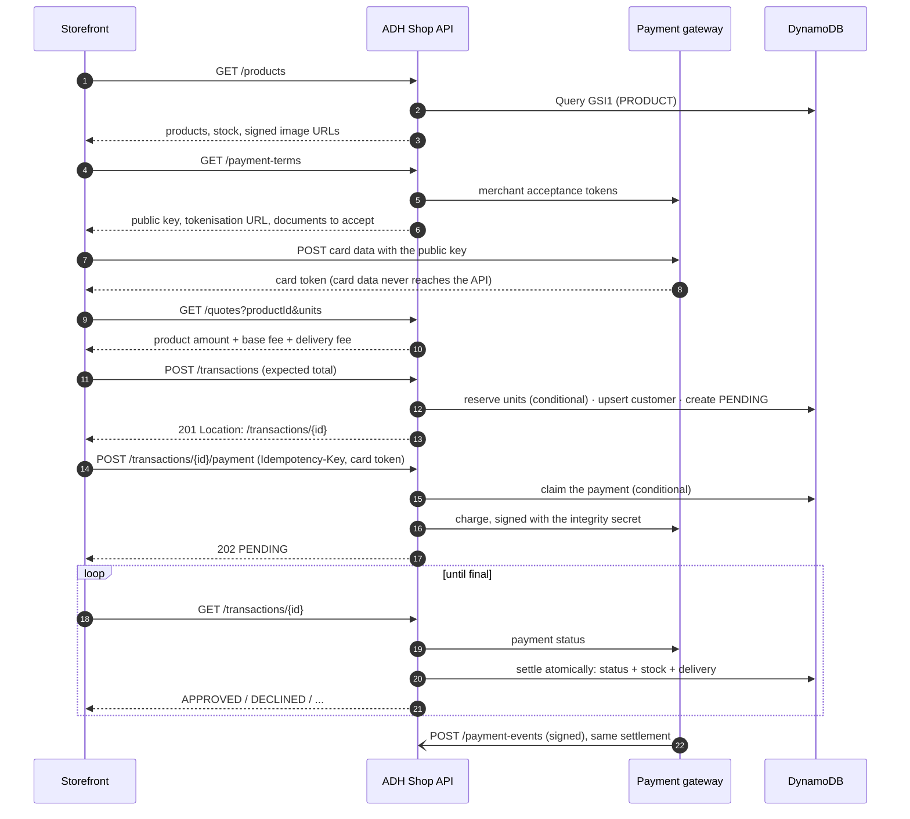

# ADH Shop API

Backend for a single-product storefront checkout: browse the catalogue, pay by card
through a payment gateway (sandbox), and receive the product. Built with NestJS and
TypeScript as a hexagonal architecture with Railway Oriented Programming, on DynamoDB,
deployed to AWS.

| Resource         | URL                                                                         |
| ---------------- | --------------------------------------------------------------------------- |
| API base         | `https://adh-api.alfredo-dominguez.dev/api/v1`                              |
| **Swagger UI**   | https://adh-api.alfredo-dominguez.dev/api/docs                              |
| OpenAPI document | https://adh-api.alfredo-dominguez.dev/api/docs-json                         |
| Liveness / ready | `/health` · `/ready`                                                        |
| Infrastructure   | [adh-shop-infra](https://github.com/alfredo0607/adh-shop-infra) (Terraform) |

---

## Contents

1. [The checkout flow](#the-checkout-flow)
2. [Endpoints](#endpoints)
3. [Architecture](#architecture)
4. [Data model](#data-model)
5. [Consistency and concurrency](#consistency-and-concurrency)
6. [Security](#security)
7. [Tests and coverage](#tests-and-coverage)
8. [Running locally](#running-locally)
9. [Configuration](#configuration)
10. [Deployment](#deployment)
11. [Engineering documentation](#engineering-documentation)

---

## The checkout flow

The storefront follows five screens: product → card and delivery details → summary →
final status → product. Each maps to the API as follows.



- **Approved:** the reserved units are sold and a delivery is assigned, in one DynamoDB
  transaction.
- **Declined, voided or error:** the units return to stock.
- **Abandoned:** a reservation unpaid after 15 minutes expires and its units return to
  stock (`EXPIRED`).
- **Refresh-safe:** the storefront only needs the transaction id. `GET /transactions/{id}`
  returns the full state, including `paymentSubmitted`, so a reload resumes at the right
  screen.

Sandbox cards: `4242 4242 4242 4242` is approved, `4111 1111 1111 1111` is declined. Any
future expiry date and CVC.

## Endpoints

All under `/api/v1`. Errors share one envelope:
`{ "error": { "code", "message", "details" }, "requestId" }`. Clients branch on `code`.

| Method | Path                          | Purpose                                                    | Success | Notable errors                                                                                  |
| ------ | ----------------------------- | ---------------------------------------------------------- | ------- | ----------------------------------------------------------------------------------------------- |
| GET    | `/products`                   | Paginated catalogue with stock and signed image URLs       | 200     | 422 `INVALID_CURSOR`                                                                            |
| GET    | `/products/{id}`              | One product                                                | 200     | 404 `PRODUCT_NOT_FOUND`                                                                         |
| GET    | `/quotes`                     | Price an order for the summary screen; reserves nothing    | 200     | 404, 409 `INSUFFICIENT_STOCK`                                                                   |
| POST   | `/transactions`               | Open a `PENDING` transaction and reserve the units         | 201     | 409 `INSUFFICIENT_STOCK`, 422 `AMOUNT_MISMATCH`, `INVALID_CUSTOMER`, `INVALID_DELIVERY_ADDRESS` |
| GET    | `/transactions/{id}`          | Read a transaction; settles it if the gateway has answered | 200     | 400 (not a UUID), 404                                                                           |
| GET    | `/transactions/{id}/delivery` | The delivery assigned to an approved transaction           | 200     | 404 `DELIVERY_NOT_FOUND`                                                                        |
| GET    | `/payment-terms`              | Acceptance documents, public key, tokenisation URL         | 200     | 503 `PAYMENT_GATEWAY_UNAVAILABLE`                                                               |
| POST   | `/transactions/{id}/payment`  | Charge the card; requires `Idempotency-Key`                | 202     | 400 (no key), 409 `TRANSACTION_NOT_PAYABLE` / `RESERVATION_EXPIRED`, 422 `PAYMENT_REJECTED`     |
| POST   | `/payment-events`             | Gateway webhook; signature verified (not in Swagger)       | 200     | 401 `INVALID_PAYMENT_EVENT`                                                                     |

HTTP semantics are deliberate: a declined card is a **successful request** whose payment
failed, so it is a status in a 200 body, never an error. `400` is for a request that
cannot be read, and `422` for one that can be read but is semantically invalid. The
complete contract, with examples, is in [Swagger](https://adh-api.alfredo-dominguez.dev/api/docs).

## Architecture

Hexagonal architecture (ports and adapters) with Railway Oriented Programming. Two
bounded contexts and a shared kernel:

```
src/
  shared/
    domain/           Result, ResultAsync, DomainError, clock and id ports — no dependencies
    infrastructure/   config, logging, health, DynamoDB client, rate limiting, idempotency
  contexts/
    catalog/          products, prices, stock, signed image URLs
    checkout/         quotes, transactions, customers, payments, settlement, deliveries
      domain/         entities, value objects, errors, PORTS
      application/    use cases — orchestration only, no I/O, no framework
      infrastructure/ adapters: HTTP controllers, DynamoDB, payment gateway, scheduler
```

- **The dependency rule is enforced by ESLint**: a domain file cannot import Nest, the
  AWS SDK, infrastructure or application code. Breaking it fails the build.
- **Ports are named for the need, not the vendor**: `PaymentGatewayPort`,
  `InventoryPort`, `ImageUrlSigner`. The checkout does not import the catalogue's
  domain; `CatalogInventoryAdapter` translates between the two.
- **Controllers only translate HTTP.** Parse, call one use case, map the result.
- **Use cases return `Result` / `ResultAsync`**, never throw for business outcomes. A
  declined payment, an out-of-stock product and a stale total are values the compiler
  forces the caller to handle. Compensation runs on the railway too: if anything fails
  after units are reserved, `orElse` releases them before the error is reported.
- **Use cases are plain classes** wired by hand in the module files, so every use case
  test is a constructor call with in-memory adapters.

Details: [`docs/guide/architecture.md`](docs/guide/architecture.md).

## Data model

One DynamoDB table (`adh-shop-store`, on-demand) and one sparse global secondary index.
A single table lets related items be read in one query and written in one transaction:
approving a payment updates the transaction, the product's stock and the delivery
atomically.

| Entity          | `PK`                       | `SK`        | `GSI1PK` / `GSI1SK`                                       | Main attributes                                                                                                                       |
| --------------- | -------------------------- | ----------- | --------------------------------------------------------- | ------------------------------------------------------------------------------------------------------------------------------------- |
| Product         | `PRODUCT#<id>`             | `#META`     | `PRODUCT` / `<id>`                                        | name, description, priceInCents, currency, imageKey, available, reserved, version                                                     |
| Customer        | `CUSTOMER#<sha256(email)>` | `#PROFILE`  | —                                                         | id, fullName, email, phone, createdAt                                                                                                 |
| Transaction     | `TRANSACTION#<uuid>`       | `#META`     | `PENDING_TRANSACTION` / deadline — **only while PENDING** | status, product, units, amounts, customer and address snapshot, reservationExpiresAt, paymentClaimedAt, gatewayTransactionId, version |
| Delivery        | `TRANSACTION#<uuid>`       | `#DELIVERY` | —                                                         | status, product, units, recipient, address, estimatedDeliveryAt                                                                       |
| Idempotency key | `IDEMPOTENCY#<key>`        | `#REQUEST`  | —                                                         | state, fingerprint, stored response, `expiresAt` (TTL)                                                                                |

| Access pattern                     | How                                                                              |
| ---------------------------------- | -------------------------------------------------------------------------------- |
| List products                      | `Query GSI1 PK = PRODUCT`, cursor-paginated                                      |
| Transaction with its delivery      | `Query PK = TRANSACTION#<id>`                                                    |
| Returning customer                 | `UpdateItem` on `CUSTOMER#<hash>`: one atomic upsert                             |
| Overdue reservations, oldest first | `Query GSI1 PK = PENDING_TRANSACTION AND SK < now`: sparse, reads only open ones |
| Expired idempotency keys           | Deleted by DynamoDB TTL on `expiresAt`                                           |

Money is always integer minor units (`8999000` = $89,990.00 COP). Customer and address are
**copied** into the transaction, so an order records what was true when it was placed.
The reservation deadline is deliberately **not** called `expiresAt`: that is the TTL
attribute, and DynamoDB would delete the order.

## Consistency and concurrency

Every invariant is enforced by the store, not by a read-then-write in the process:

| Risk                                     | Guard                                                                                                                                   |
| ---------------------------------------- | --------------------------------------------------------------------------------------------------------------------------------------- |
| Two buyers take the last unit            | `UpdateItem … ConditionExpression available >= :units`                                                                                  |
| Double tap / retry charges twice         | `Idempotency-Key` replays the stored response; **and** the transaction is claimed with a conditional write before the gateway is called |
| Webhook and polling settle at once       | Settlement conditioned on `status = PENDING AND version = previous`; the loser re-reads                                                 |
| Approval leaves stock or delivery behind | `TransactWriteItems`: transaction + stock + delivery, all or nothing                                                                    |
| Buyer abandons checkout                  | Expiry job every 60 s; never expires a payment still in flight at the gateway                                                           |
| Charge call times out                    | Claim kept, outcome found later by reference; nothing is charged twice                                                                  |
| Price changes between summary and pay    | Client sends the total it showed; mismatch → `422 AMOUNT_MISMATCH`                                                                      |

These are verified against a real engine in
[`single-table.integration.spec.ts`](src/shared/infrastructure/persistence/single-table.integration.spec.ts):
ten concurrent buyers for three units produce exactly three reservations, two concurrent
payment claims produce exactly one, and an inconsistent stock row rolls the whole
settlement back.

## Security

- **Card data never reaches this service.** The storefront tokenises the card directly
  with the gateway; the API accepts only a token and refuses anything shaped like a card
  number.
- **The server owns the amount.** It is recomputed from stored prices and fees, taken
  from the stored transaction at charge time, and signed with the integrity secret.
- **Webhook authenticity**: SHA-256 checksum verified in constant time; events older
  than 24 h are refused.
- **Validation at the edge**: global `ValidationPipe` with `whitelist` and
  `forbidNonWhitelisted`, which blocks mass assignment. Domain rules return specific codes.
- **No data leaks**: response DTOs are built explicitly (no `reserved`, `version`, phone
  or full email); 5xx bodies are opaque, with the detail in the log under the `requestId`.
  Card, token and secret fields are redacted from logs.
- **Rate limiting**: 100 requests / minute per client IP, shared through ElastiCache
  (Valkey, IAM auth) with an atomic Lua script. The client IP is read through two trusted
  proxies, and the origin accepts HTTPS **only from Cloudflare's ranges**, so the header
  cannot be forged by skipping the edge.
- **Headers and transport**: Helmet (HSTS and others), HTTPS only, CORS limited to the
  storefront's origin, `Cache-Control: no-store` on every personal or payment response.
- **Secrets** live in SSM Parameter Store (SecureString) and reach the container only at
  deploy time. None are in the code, the image or Terraform state.
- **Images**: private S3 bucket, readable only by CloudFront, served through signed,
  expiring URLs.

Details: [`docs/guide/security.md`](docs/guide/security.md).

## Tests and coverage

```
pnpm test        # 479 tests
pnpm test:cov    # with the 80% threshold enforced
```

Latest run: **46 suites, 479 tests, all passing.**

| Scope                            | Statements |   Branches |  Functions |      Lines |
| -------------------------------- | ---------: | ---------: | ---------: | ---------: |
| **All files**                    | **97.94%** | **87.62%** | **98.02%** | **97.97%** |
| catalog · domain                 |     97.08% |     93.10% |       100% |     97.00% |
| catalog · application            |       100% |       100% |       100% |       100% |
| catalog · persistence            |     98.00% |     86.95% |     96.96% |     97.84% |
| checkout · domain                |     98.50% |     96.29% |       100% |     98.49% |
| checkout · application           |     97.24% |     84.61% |     96.49% |     97.85% |
| checkout · payment gateway       |     98.00% |     93.18% |       100% |     97.93% |
| checkout · persistence           |     97.12% |     85.24% |     98.18% |     96.92% |
| shared · domain (Result, errors) |     99.09% |     93.75% |       100% |     99.00% |
| shared · idempotency             |     97.70% |     76.19% |     94.44% |     98.78% |
| shared · rate limit              |     93.33% |     75.00% |     93.33% |     92.64% |

What the suite covers, beyond line counts:

- **Domain**: every entity and value object, including money arithmetic in cents, stock
  transitions, the payment claim, settlement and expiry rules.
- **Use cases** against in-memory adapters that behave like the real ones: compensation
  after a failed write, idempotent settlement, lost races, gateway outages.
- **HTTP contracts** through the real pipe and exception filter: status codes, `Location`,
  validation, replayed idempotent responses, and fields that must not appear.
- **Integration against real engines**: DynamoDB Local for conditions, transactions and
  the sparse index; Redis for the rate limiter's Lua script.
- **The built container** is started in CI against DynamoDB Local and probed: `/ready`,
  the OpenAPI document, and the storefront's CORS preflight.

The integration specs need DynamoDB Local and Redis running (see below). CI provides both
as service containers.

## Running locally

Requirements: Node 24, pnpm, Docker.

```bash
# 1. Dependencies and configuration
pnpm install
cp .env.example .env        # fill in the payment gateway sandbox keys

# 2. Local stores
docker run -d --name dynamodb -p 8000:8000 amazon/dynamodb-local:2.5.4
docker run -d --name redis    -p 6379:6379 redis:7-alpine

# 3. The table, with the production key schema
AWS_ACCESS_KEY_ID=local AWS_SECRET_ACCESS_KEY=local AWS_DEFAULT_REGION=us-east-1 \
aws dynamodb create-table --endpoint-url http://localhost:8000 \
  --table-name adh-shop-local --billing-mode PAY_PER_REQUEST \
  --attribute-definitions AttributeName=PK,AttributeType=S AttributeName=SK,AttributeType=S \
                          AttributeName=GSI1PK,AttributeType=S AttributeName=GSI1SK,AttributeType=S \
  --key-schema AttributeName=PK,KeyType=HASH AttributeName=SK,KeyType=RANGE \
  --global-secondary-indexes 'IndexName=GSI1,KeySchema=[{AttributeName=GSI1PK,KeyType=HASH},{AttributeName=GSI1SK,KeyType=RANGE}],Projection={ProjectionType=ALL}'

# 4. Seed the catalogue and start
pnpm seed
pnpm start:dev              # http://localhost:3000/api/docs
```

The seed is idempotent: re-running it restores the demo stock levels.

## Configuration

Validated once at boot with zod. A missing or malformed variable stops the process and
lists every problem at once. Production refuses to start without the image CDN settings.
See [`.env.example`](.env.example) for every variable with its rationale.

| Group           | Variables                                                                                                                                   |
| --------------- | ------------------------------------------------------------------------------------------------------------------------------------------- |
| Runtime         | `NODE_ENV`, `PORT`, `LOG_LEVEL`                                                                                                             |
| Data            | `AWS_REGION`, `DYNAMODB_TABLE_NAME`, `DYNAMODB_ENDPOINT` (local only)                                                                       |
| Payment gateway | `PAYMENT_API_URL`, `PAYMENT_PUBLIC_KEY`, `PAYMENT_PRIVATE_KEY`, `PAYMENT_INTEGRITY_SECRET`, `PAYMENT_EVENTS_SECRET`, `PAYMENT_TIMEOUT_MS`   |
| Pricing         | `BASE_FEE_IN_CENTS` (500.00), `DELIVERY_FEE_IN_CENTS` (1,200.00), `RESERVATION_TTL_MINUTES` (15), `RESERVATION_SWEEP_INTERVAL_SECONDS` (60) |
| Images          | `CDN_DOMAIN`, `CDN_KEY_PAIR_ID`, `CDN_PRIVATE_KEY_BASE64`, `IMAGE_URL_TTL_SECONDS`                                                          |
| Rate limiting   | `REDIS_*`, `RATE_LIMIT_*`, `TRUST_PROXY_HOPS`                                                                                               |
| HTTP            | `CORS_ALLOWED_ORIGINS`                                                                                                                      |

## Deployment

Deployed on AWS, provisioned with Terraform in
[adh-shop-infra](https://github.com/alfredo0607/adh-shop-infra):

```
Client ──HTTPS──▶ Cloudflare ──HTTPS (Cloudflare IPs only)──▶ EC2: nginx ──▶ Docker: API
                                                                   │
            DynamoDB (VPC gateway endpoint) · ElastiCache Valkey (IAM) · SSM Parameter Store
            ECR (image) · S3 + CloudFront (signed product images) · CloudWatch (logs)
```

- **CI** (every pull request): lint, typecheck, tests with coverage against Redis and
  DynamoDB Local, dependency audit, a check that no test code reaches the build, and the
  built image started and probed.
- **CD** (every merge to `main`): GitHub Actions assumes an AWS role through **OIDC** (no
  stored keys), pushes the image to ECR tagged with the commit SHA, and runs `deploy.sh` on
  the host through SSM.
- **Blue/green**: the new container starts on the idle port and must answer `/ready`, which
  reads the table, before nginx switches traffic. A release that cannot reach its data is
  never switched to, and the previous version keeps serving.
- **Graceful shutdown**: SIGTERM drains requests, closes the Redis connection and stops
  the expiry timer; `dumb-init` forwards signals; the image runs as a non-root user.

## Engineering documentation

| Document                                                   | Content                                       |
| ---------------------------------------------------------- | --------------------------------------------- |
| [`docs/guide/architecture.md`](docs/guide/architecture.md) | Layers, dependency rule, ports, ROP contract  |
| [`docs/guide/api-design.md`](docs/guide/api-design.md)     | Status codes, idempotency, pagination, errors |
| [`docs/guide/security.md`](docs/guide/security.md)         | Security standards                            |
| [`docs/guide/testing.md`](docs/guide/testing.md)           | What is tested, and how                       |
| [`docs/guide/git-workflow.md`](docs/guide/git-workflow.md) | Branches, commits, pull requests              |
| [`docs/audits/`](docs/audits/README.md)                    | Technical audits and their findings           |
